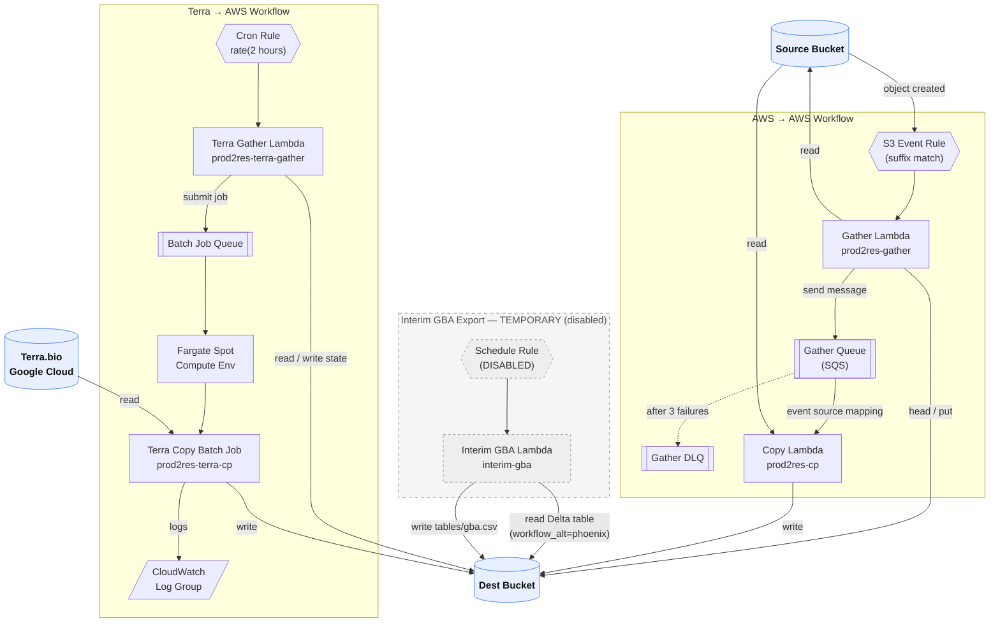

```mermaid
flowchart TD
    %% ---------- Shared storage ----------
    SRC[("Source Bucket")]
    DST[("Dest Bucket")]
    TERRA[("Terra.bio<br/>Google Cloud")]

    %% ---------- AWS to AWS ----------
    subgraph AWS2AWS["AWS &rarr; AWS Workflow"]
        S3EVT{{"S3 Event Rule<br/>(suffix match)"}}
        GATHER["Gather Lambda<br/>prod2res-gather"]
        GQ[["Gather Queue<br/>(SQS)"]]
        DLQ[["Gather DLQ"]]
        COPY["Copy Lambda<br/>prod2res-cp"]
    end

    %% ---------- Terra to AWS ----------
    subgraph TERRA2AWS["Terra &rarr; AWS Workflow"]
        TCRON{{"Cron Rule<br/>rate(2 hours)"}}
        TGATHER["Terra Gather Lambda<br/>prod2res-terra-gather"]
        TQUEUE[["Batch Job Queue"]]
        TCOMPUTE["Fargate Spot<br/>Compute Env"]
        TJOB["Terra Copy Batch Job<br/>prod2res-terra-cp"]
        TLOG[/"CloudWatch<br/>Log Group"/]
    end

    %% ---------- Interim GBA (temporary) ----------
    subgraph GBA["Interim GBA Export &mdash; TEMPORARY (disabled)"]
        GCRON{{"Schedule Rule<br/>(DISABLED)"}}
        GBAFN["Interim GBA Lambda<br/>interim-gba"]
    end

    %% ---------- AWS to AWS flows ----------
    SRC -- "object created" --> S3EVT
    S3EVT --> GATHER
    GATHER -- "read" --> SRC
    GATHER -- "head / put" --> DST
    GATHER -- "send message" --> GQ
    GQ -. "after 3 failures" .-> DLQ
    GQ -- "event source mapping" --> COPY
    SRC -- "read" --> COPY
    COPY -- "write" --> DST

    %% ---------- Terra to AWS flows ----------
    TCRON --> TGATHER
    TGATHER -- "read / write state" --> DST
    TGATHER -- "submit job" --> TQUEUE
    TQUEUE --> TCOMPUTE
    TCOMPUTE --> TJOB
    TERRA -- "read" --> TJOB
    TJOB -- "write" --> DST
    TJOB -- "logs" --> TLOG

    %% ---------- Interim GBA flows ----------
    GCRON --> GBAFN
    GBAFN -- "read Delta table<br/>(workflow_alt=phoenix)" --> DST
    GBAFN -- "write tables/gba.csv" --> DST

    %% ---------- Styling ----------
    classDef bucket fill:#e8f0fe,stroke:#4285f4,color:#111,font-weight:bold;
    class SRC,DST,TERRA bucket;

    style GBA fill:#f5f5f5,stroke:#999,stroke-dasharray:5 5,color:#555;
    style GCRON fill:#eeeeee,stroke:#999,stroke-dasharray:4 4;
    style GBAFN fill:#eeeeee,stroke:#999,stroke-dasharray:4 4;
```