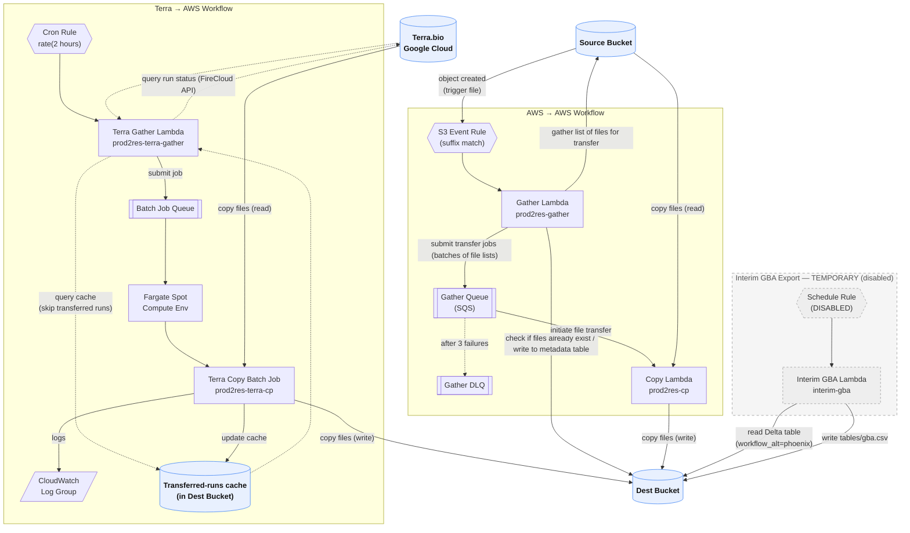
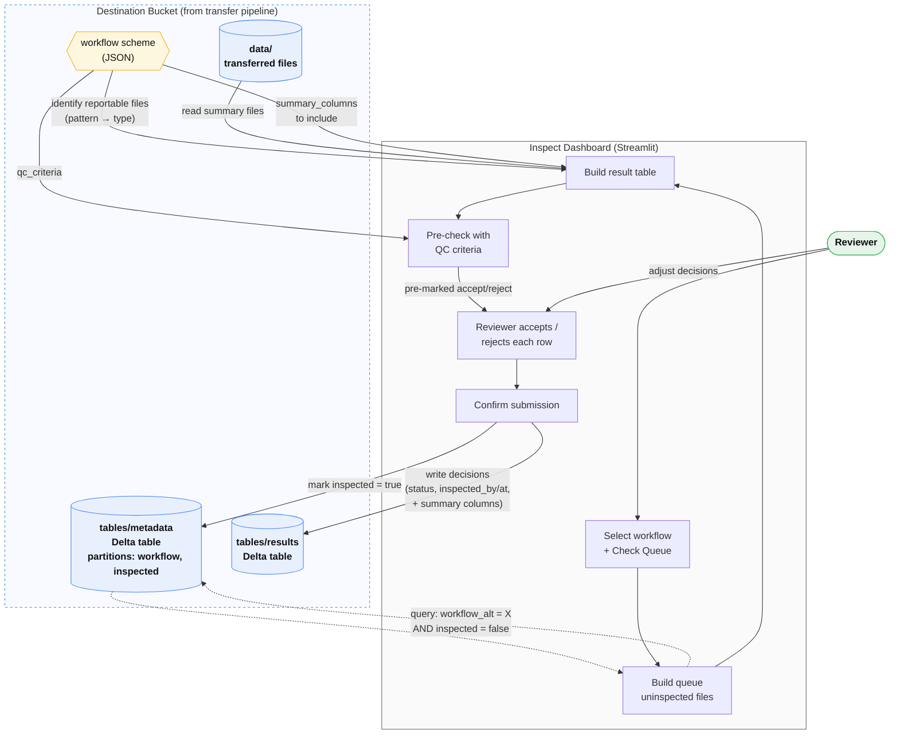

## Data Transfer Workflow

```mermaid
flowchart TD
    %% ---------- Shared storage ----------
    SRC[("Source Bucket")]
    DST[("Dest Bucket")]
    TERRA[("Terra.bio<br/>Google Cloud")]

    %% ---------- AWS to AWS ----------
    subgraph AWS2AWS["AWS &rarr; AWS Workflow"]
        S3EVT{{"S3 Event Rule<br/>(suffix match)"}}
        GATHER["Gather Lambda<br/>prod2res-gather"]
        GQ[["Gather Queue<br/>(SQS)"]]
        DLQ[["Gather DLQ"]]
        COPY["Copy Lambda<br/>prod2res-cp"]
    end

    %% ---------- Terra to AWS ----------
    subgraph TERRA2AWS["Terra &rarr; AWS Workflow"]
        TCRON{{"Cron Rule<br/>rate(2 hours)"}}
        TGATHER["Terra Gather Lambda<br/>prod2res-terra-gather"]
        TQUEUE[["Batch Job Queue"]]
        TCOMPUTE["Fargate Spot<br/>Compute Env"]
        TJOB["Terra Copy Batch Job<br/>prod2res-terra-cp"]
        TLOG[/"CloudWatch<br/>Log Group"/]
        TCACHE[("Transferred-runs cache<br/>(in Dest Bucket)")]
    end

    %% ---------- Interim GBA (temporary) ----------
    subgraph GBA["Interim GBA Export &mdash; TEMPORARY (disabled)"]
        GCRON{{"Schedule Rule<br/>(DISABLED)"}}
        GBAFN["Interim GBA Lambda<br/>interim-gba"]
    end

    %% ---------- AWS to AWS flows ----------
    SRC -- "object created \n(trigger file)" --> S3EVT
    S3EVT --> GATHER
    GATHER -- "gather list of files for transfer" --> SRC
    GATHER -- "check if files already exist / write to metadata table" --> DST
    GATHER -- "submit transfer jobs (batches of file lists)" --> GQ
    GQ -. "after 3 failures" .-> DLQ
    GQ -- "initiate file transfer" --> COPY
    SRC -- "copy files (read)" --> COPY
    COPY -- "copy files (write)" --> DST

    %% ---------- Terra to AWS flows ----------
    TCRON --> TGATHER
    TGATHER -. "query run status (FireCloud API)" .-> TERRA
    TGATHER -. "query cache<br/>(skip transferred runs)" .-> TCACHE
    TGATHER -- "submit job" --> TQUEUE
    TCACHE  -.-> TGATHER
    TQUEUE --> TCOMPUTE
    TCOMPUTE --> TJOB
    TERRA   -.-> TGATHER
    TERRA -- "copy files (read)" --> TJOB
    TJOB -- "copy files (write)" --> DST
    TJOB -- "update cache" --> TCACHE
    TJOB -- "logs" --> TLOG

    %% ---------- Interim GBA flows ----------
    GCRON --> GBAFN
    GBAFN -- "read Delta table<br/>(workflow_alt=phoenix)" --> DST
    GBAFN -- "write tables/gba.csv" --> DST

    %% ---------- Styling ----------
    classDef bucket fill:#e8f0fe,stroke:#4285f4,color:#111,font-weight:bold;
    class SRC,DST,TERRA,TCACHE bucket;

    classDef api fill:#fef7e0,stroke:#f9ab00,color:#111;

    style GBA fill:#f5f5f5,stroke:#999,stroke-dasharray:5 5,color:#555;
    style GCRON fill:#eeeeee,stroke:#999,stroke-dasharray:4 4;
    style GBAFN fill:#eeeeee,stroke:#999,stroke-dasharray:4 4;
```
## Results Inspection & Reporting Workflow

```mermaid
flowchart TD
    %% ---------- Storage in Dest Bucket ----------
    subgraph DEST["Destination Bucket (from transfer pipeline)"]
        DATA[("data/<br/>transferred files")]
        META[("tables/metadata<br/>Delta table<br/>partitions: workflow, inspected")]
        RESULTS[("tables/results<br/>Delta table")]
        SCHEME{{"workflow scheme<br/>(JSON)"}}
    end

    %% ---------- Dashboard ----------
    subgraph DASH["Inspect Dashboard (Streamlit)"]
        SELECT["Select workflow<br/>+ Check Queue"]
        QUEUE["Build queue<br/>uninspected files"]
        BUILD["Build result table"]
        QC["Pre-check with<br/>QC criteria"]
        REVIEW["Reviewer accepts /<br/>rejects each row"]
        CONFIRM["Confirm submission"]
    end

    USER(["Reviewer"])

    %% ---------- Queue construction ----------
    QUEUE  -. "query: workflow_alt = X<br/>AND inspected = false" .-> META
    META -.-> QUEUE
    SELECT --> QUEUE
    USER --> SELECT

    %% ---------- Result table construction ----------
    QUEUE --> BUILD
    SCHEME -- "identify reportable files<br/>(pattern → type)" --> BUILD
    DATA -- "read summary files" --> BUILD
    SCHEME -- "summary_columns<br/>to include" --> BUILD
    BUILD --> QC
    SCHEME -- "qc_criteria" --> QC

    %% ---------- Review + submit ----------
    QC -- "pre-marked accept/reject" --> REVIEW
    USER -- "adjust decisions" --> REVIEW
    REVIEW --> CONFIRM

    %% ---------- Writes on submit ----------
    CONFIRM -- "write decisions<br/>(status, inspected_by/at,<br/>+ summary columns)" --> RESULTS
    CONFIRM -- "mark inspected = true" --> META

    %% ---------- Styling ----------
    classDef store fill:#e8f0fe,stroke:#4285f4,color:#111,font-weight:bold;
    class DATA,META,RESULTS store;

    classDef scheme fill:#fef7e0,stroke:#f9ab00,color:#111;
    class SCHEME scheme;

    classDef actor fill:#e6f4ea,stroke:#34a853,color:#111,font-weight:bold;
    class USER actor;

    style DEST fill:#f8faff,stroke:#4285f4,stroke-dasharray:4 4;
    style DASH fill:#fafafa,stroke:#666;
```
